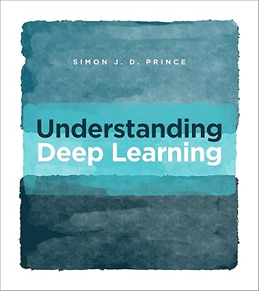

# Understand Deep Learning from Simon J.D. Prince

  

  

Deep Learning exercise solutions for the book "Understanding Deep Learning" from Simon J.D. Prince.
Subsets of the real solutions are available on the website <a href=https://udlbook.github.io/udlbook/>https://udlbook.github.io/udlbook/</a>.  
Keep in mind that these are mine solutions and therefore there could be some minor issues. :)
